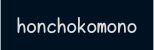
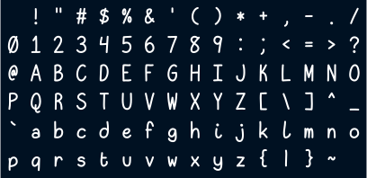

  

**honchokomono** is a sans-serif monospace font made to resemble my handwriting.
It is designed to make my terminal look cute and to look nice when writing C or
TeX.

## Installation

grab it from the releases or something

good luck

## Styles

literally just regular or whatever. im working on making italics. sometimes.
this is really tiring okay

## Features

none????????

## Character set

i did the bare minimum, just the ascii chars LOL

## Screenshots

will take some eventually

## Construction

here im supposed to write about how i made this. gonna do this later

## Building

still not done

## Todo

 - just remake the entire thing with strokes
 - italics
 - boldface
 - light
 - programming ligatures
 - diacritics
 - math symbols
 - greek chars
