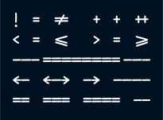

  

**honchokomono** is a sans-serif monospace font made to resemble my handwriting.
It is designed to make my terminal look cute and to look nice when writing C or
TeX.

## Installation

grab it from the releases or something

good luck

## Styles

## Features

some programming ligatures, thats kinda it

## Character set

i did the bare minimum, just the ascii chars LOL

## Screenshots

will take some eventually

## Building

still not done

## Todo

 - take some screenshots
 - diacritics
 - box drawing glyphs
 - math symbols
 - greek chars

## Give Me Money

https://ko-fi.com/honchokomodo
